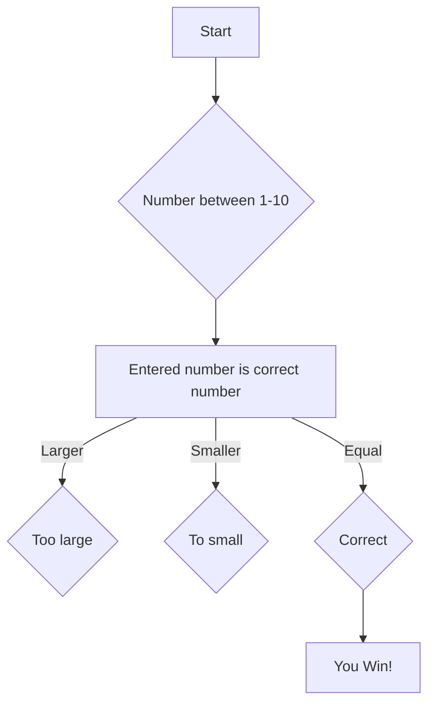

# Step 1: Start - step 2: Pick a number between 1-10
# Step 3: Check if number is correct or not
# Step 4: If number is too big, try again - Step 5: If number is too small, try again
# Step 6: If equal, you win!